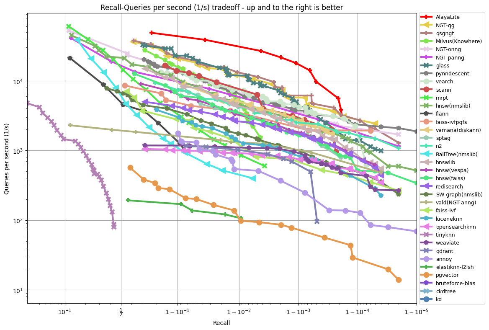
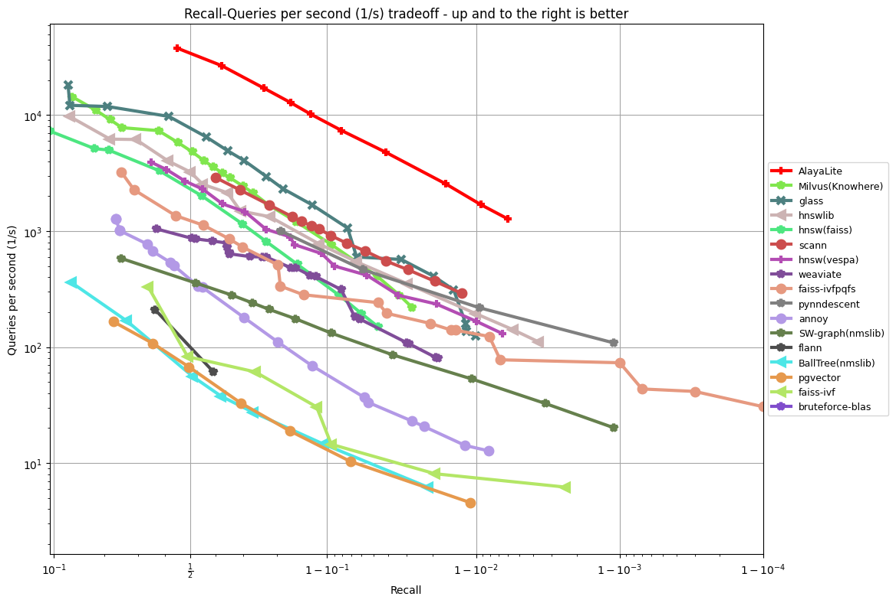
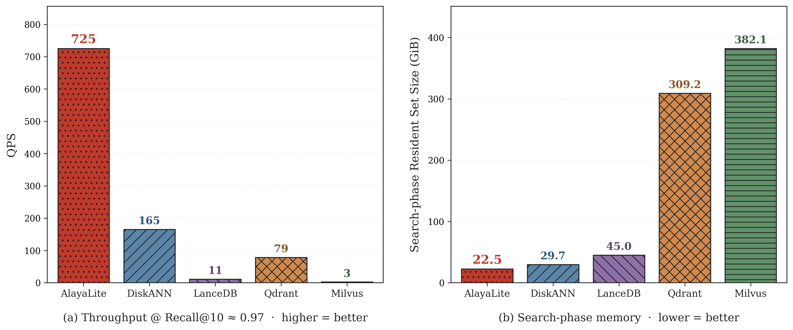

<p align="center">
  <a href="https://github.com/AlayaDB-AI"></a>
</p>


<p align="center">
    <b>AlayaLite – A Fast, Flexible Vector Database for Everyone</b>. <br />
    Seamless Knowledge, Smarter Outcomes.
</p>

<div class="column" align="middle">
  <a href="https://github.com/AlayaDB-AI/AlayaLite/releases"></a>
  <a href="https://pypi.org/project/alayalite/"></a>
  <a href="https://github.com/AlayaDB-AI/AlayaLite/blob/main/LICENSE"></a>
  <a href="https://codecov.io/github/AlayaDB-AI/AlayaLite"></a>
  <a href="https://github.com/AlayaDB-AI/AlayaLite/actions/workflows/code-checker.yaml"></a>
  <a href="https://discord.gg/ReEHqSx97"></a>
  <a href="https://x.com/home"></a>
</div>


## Features

- **High Performance**: Modern vector techniques integrated into a well-designed architecture.
- **Elastic Scalability**: Seamlessly scale across multiple threads, which is optimized by C++20 coroutines.
- **Adaptive Flexibility**: Easy customization for quantization methods, metrics, and data types.
- **Two index paths in one package**: an in-memory graph + RaBitQ path for low-latency
  retrieval, and the **LASER** on-disk Quantized Graph index for billion-scale workloads
  that do not fit in RAM.
- **Ease of Use**: [Intuitive APIs](https://github.com/AlayaDB-AI/AlayaLite/blob/main/python/README.md) in Python.


## Getting Started!

Get started with just one command!
```bash
pip install alayalite             # with pip
# or
uv pip install alayalite          # with uv (standalone)
uv add alayalite                  # in a uv-managed project
```


### In-memory index: quick start

Access your vectors using simple APIs.
```python
from alayalite import Client, Index
from alayalite.utils import calc_recall, calc_gt
import numpy as np

# Initialize the client and create an index. The client can manage multiple indices with distinct names.
client = Client()
index = client.create_index("default")

# Generate random vectors and queries, then calculate the ground truth top-10 nearest neighbors for each query.
vectors = np.random.rand(1000, 128).astype(np.float32)
queries = np.random.rand(10, 128).astype(np.float32)
gt = calc_gt(vectors, queries, 10)

# Insert vectors to the index
index.fit(vectors)

# Perform batch search for the queries and retrieve top-10 results
result = index.batch_search(queries, 10)

# Compute the recall based on the search results and ground truth
recall = calc_recall(result, gt)
print(recall)
```

### LASER on-disk index: quick start

For datasets that exceed RAM, the **LASER** on-disk Quantized Graph index keeps
hot data on SSD and only the search-time working set in memory. Vectors must be
`float32` with `raw_dim >= 128`; L2 is the only supported metric in v1.

LASER is available on Linux x86_64 (libaio backend, default), macOS
(thread-pool backend), and Windows x64 (IOCP backend). Linux x86_64 builds
need `libaio` headers — `sudo apt-get install libaio-dev` on Debian/Ubuntu.
See [`docs/LASER.md`](./docs/LASER.md) for build flags, tuning notes, and the
TOML-driven CLI.

LASER `Index.fit` pulls in PCA / k-means / progress-bar helpers (`scikit-learn`,
`faiss-cpu`, `tqdm`), which are declared as the `[laser]` extra so the base
install stays lean. Install them on top of the base wheel:

```bash
pip install 'alayalite[laser]'
# or, with uv:
uv pip install 'alayalite[laser]'
```

```python
from alayalite.laser import BuildParams, Index
import numpy as np

# Build artifacts (PCA, medoids, Vamana graph, LASER index) land in `output_dir/`.
vectors = np.random.rand(100_000, 128).astype(np.float32)
queries = np.random.rand(100, 128).astype(np.float32)

idx = Index.fit(
    vectors,
    output_dir="/tmp/alaya_laser",
    name="demo",
    build_params=BuildParams(
        metric="l2", R=64, L=200, alpha=1.2,
        ef_indexing=200,
        # ep_num is the medoid count used as search entry points. faiss
        # kmeans wants training points >= 39 * ep_num; at n=100K with the
        # default 10% sample (=10K), keep ep_num <= ~250. Use ep_num=300+
        # at n>=200K. See docs/LASER.md for tuning notes.
        ep_num=100,
    ),
    seed=42,
    num_threads=16,
    dram_budget_gb=2.0,
)

# Search-time knobs are separate from build params.
idx.set_params(ef_search=200, num_threads=8, beam_width=16)
ids = idx.batch_search(queries, 10)

# Reopen an existing build later without rebuilding:
# idx = Index.from_prefix("/tmp/alaya_laser/demo", dram_budget_gb=2.0)
```

## Benchmark

AlayaLite ships two complementary index paths. The benchmarks below cover both.

### In-memory index vs. ANN-Benchmarks

We evaluate the in-memory path against other vector database systems using
[ANN-Benchmark](https://github.com/erikbern/ann-benchmarks) (compile locally and
open `-march=native` in your `CMakeLists.txt` to reproduce the results).

|          |        |
| :---------------------------------------------------------: | :-----------------------------------------------------------: |
| <div style="text-align: center;">**Fashion-MNIST	784 Euclidean**</div> | <div style="text-align: center;">**Gist 960 Euclidean**</div> |

### On-disk LASER vs. other large-scale systems

For the on-disk path, we compare LASER against other disk-resident vector
systems on **DPR100M** (101M vectors × 768 dimensions, L2). Numbers are read
directly from the benchmark output — see the
[AlayaLaser paper](https://arxiv.org/abs/2602.23342) (SIGMOD 2026) for the
algorithm details.



At Recall@10 ≈ 0.97, LASER serves about **725 QPS** — roughly 4.4× DiskANN
(165), 9.2× Qdrant (79), and 66× LanceDB (11) on this dataset, while Milvus
(3) does not reach this recall band reliably. The search-phase resident set
is **22.5 GiB**, an order of magnitude below Qdrant (309.2 GiB) and Milvus
(382.1 GiB) on the same workload.


## Contributing

We welcome contributions to AlayaLite! If you would like to contribute, please follow these steps:

1. Start by creating an issue outlining the feature or bug you plan to work on.
2. We will collaborate on the best approach to move forward based on your issue.
3. Fork the repository, implement your changes, and commit them with a clear message.
4. Push your changes to your forked repository.
5. Submit a pull request to the main repository.

Please ensure that your code follows the coding standards of the project and includes appropriate tests.

## Acknowledgements

We would like to thank all the contributors and users of AlayaLite for their support and feedback.

## Contact

If you have any questions or suggestions, please feel free to open an issue or contact us at **dev@alayadb.ai**.

For Chinese-speaking users, you can join our WeChat discussion group by scanning the QR code below:

<p align="center">
  
</p>


## License

[AGPL-3.0](https://github.com/AlayaDB-AI/AlayaLite/blob/main/LICENSE)
